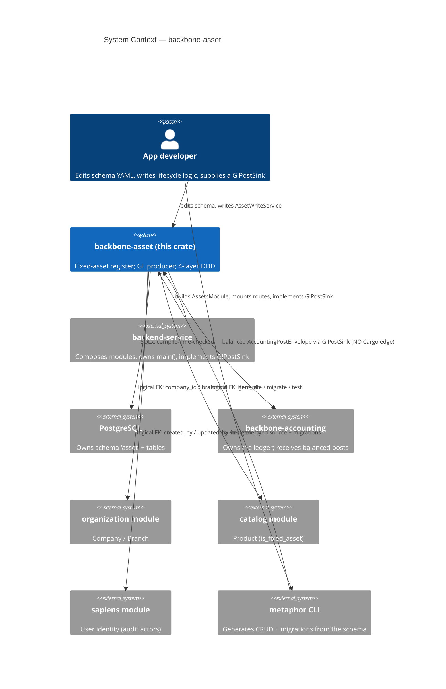
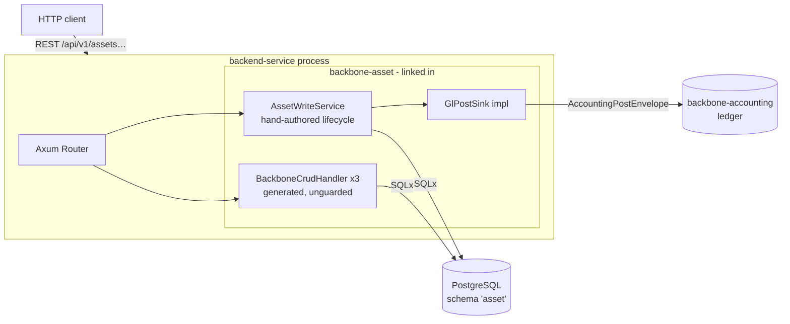
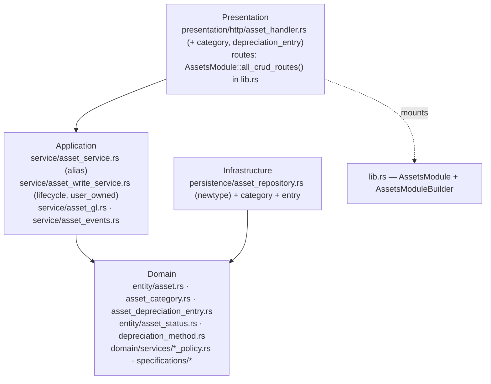

<!-- Reader: Maintainer · Mode: Explanation -->
# Architecture

`backbone-asset` is a **library crate** that owns the fixed-asset bounded context as four DDD layers.
It does not run on its own — a `backend-service` composes it, hands it a Postgres pool and a
`GlPostSink`, and mounts its router. This page shows the system top-down (C4), names the **two route
surfaces** (generated CRUD vs. the hand-authored lifecycle), then traces the capitalize → depreciate
→ dispose flow end to end.

## 1. Context

Who uses the module, and what it depends on.



*What to notice: the arrow to accounting is a **contract, not a code dependency** — assets emits a
balanced envelope through a seam the service implements. Every other cross-module arrow is a
**logical foreign key**, not a database constraint. The module is a dependency, never an entrypoint.*

## 2. Containers

The module compiles into the service binary; there is no separate asset process.



*What to notice: **two surfaces reach the same tables.** The generated CRUD is ordinary
`BackboneCrudHandler` routers; the lifecycle is `AssetWriteService`, which the service also exposes.
Only the lifecycle path talks to the ledger, and only through the service-supplied `GlPostSink`.*

## 3. Components / modules — the DDD 4-layer shape

Dependencies point **inward only**. Domain depends on nothing.



| Layer | Directory | Holds | May depend on |
|-------|-----------|-------|---------------|
| **Domain** | `src/domain/` | `Asset`, `AssetCategory`, `AssetDepreciationEntry` entities; `AssetStatus` / `DepreciationMethod` enums; repository **traits** (ports); domain policies & specifications | nothing |
| **Application** | `src/application/` | the three CRUD **service aliases** (`service/`); the **hand-authored** `AssetWriteService` (lifecycle), `asset_gl` (the `GlPostSink` port + `AccountingPostEnvelope`), `asset_events`; `validator/` | domain |
| **Infrastructure** | `src/infrastructure/` | repository **newtypes** over `GenericCrudRepository` (`persistence/`) | domain, application |
| **Presentation** | `src/presentation/` | the three `BackboneCrudHandler` route builders (`http/`) and their DTOs (`dto/`); the router is composed in `lib.rs` | application |
| **Composition** | `src/lib.rs` | **`AssetsModule` / `AssetsModuleBuilder`**, public re-exports | all layers (it is the root) |

> **Generated-but-unwired subtrees.** The skeleton emitted several subtrees that their parent
> `mod.rs` does **not** declare, so they never compile into the crate: `application/{auth,
> bulk_operations, subscriptions, usecases}`, `infrastructure/{event_store, integration}`,
> `presentation/versioning`, `presentation/http/routes`, `config/`, and `exports/`. They are inert
> scaffolding — activate one by declaring it in the parent `mod.rs` (inside a `// <<< CUSTOM` region)
> before relying on it. The purely-`Example` residue and the dead `module.rs` / `routes/` / `handlers/`
> files have been **removed**; the real composition root is `AssetsModule` in `lib.rs`.

A subtlety worth internalizing: there are **two repository types per entity**. The domain layer
defines a repository **trait** (the *port*); the infrastructure layer defines a repository **struct**
newtype over `GenericCrudRepository<…>` (the *adapter*). The port is the contract; the adapter is the
Postgres implementation.

## 3a. The two route surfaces — read this before deploying

`AssetsModule` exposes the **generated CRUD** on all three entities:

```rust
// lib.rs — the UNGUARDED full surface
let router = assets.all_crud_routes();   // 12 endpoints × 3 entities, no domain validation
```

`all_crud_routes()` (and its `#[deprecated]` alias `routes()`) mounts `BackboneCrudHandler` for every
entity. This surface is **honest generic CRUD and nothing more**: a well-formed `POST /assets` can
create a row with `salvage_value > gross`, or skip the lifecycle entirely, because **none of the
business invariants live in the generated service** — they live in `AssetWriteService`. Use
`all_crud_routes()` only in trusted/admin/seeding contexts.

The **lifecycle surface** is the hand-authored `AssetWriteService` — `create_category`,
`create_asset`, `activate_asset`, `run_depreciation`, `dispose_asset`. This is where the
register/onboarding/capitalize/depreciate/dispose rules (BR-1…BR-5) and the GL posting actually run.
A production composition exposes the lifecycle for writes and, at most, the generated CRUD for reads.

`AssetsModule::all_crud_routes()` (in `lib.rs`) is the **only wired router**. The skeleton's
`src/routes/` composers (`get_routes` / `get_routes_with_state`) and `src/handlers/` `AppState`
container were never declared in `lib.rs` and have been **removed** as dead code. To add a stateful
custom-handler surface, hand-author it in a `user_owned` file and merge it with `all_crud_routes()` at
the composition root (see the [Maintainer Guide](05-maintainer-guide.md#adding-a-non-crud-endpoint)).

## 4. Data & control flow — the asset lifecycle end to end

Each verb of `AssetWriteService` **posts to the GL first, then flips a one-way gate**, so a retry
never double-posts. Here is the full life of one asset.

```mermaid
sequenceDiagram
    actor Caller as backend-service
    participant W as AssetWriteService
    participant DB as PostgreSQL (schema 'asset')
    participant GL as GlPostSink → accounting
    participant Bus as AssetEventSink

    Note over Caller,W: register
    Caller->>W: create_category(policy + 4 GL accounts)
    Caller->>W: create_asset(gross, salvage, life, opening?)
    Note over W: validate salvage∈[0,gross), opening∈[0,depreciable),<br/>≥1¢/period; snapshot life from category
    W->>DB: INSERT asset (status=draft, nbv=gross−opening)

    Note over Caller,W: activate = capitalize + schedule
    Caller->>W: activate_asset(funding_account, at)
    alt brand-new (opening == 0)
        W->>GL: Dr Fixed Asset · Cr Funding  (key acquire:{asset})
    else onboarded existing (opening > 0)
        Note over W: NO capitalization — already on the opening trial balance
    end
    W->>DB: gate draft→active + INSERT schedule (remaining life,<br/>last period absorbs residue)
    W->>Bus: AssetActivated

    Note over Caller,W: depreciate (each period due ≤ up_to)
    Caller->>W: run_depreciation(up_to)
    loop each unposted due period
        W->>DB: BEGIN; SELECT status FOR UPDATE (serialize vs dispose)
        W->>DB: claim period (posted=true) — idempotent gate
        W->>GL: Dr Depreciation Expense · Cr Accum Dep  (key depr:{entry})
        W->>DB: advance accumulated / nbv; last period → fully_depreciated; COMMIT
        W->>Bus: DepreciationPosted
    end

    Note over Caller,W: dispose = net off the books
    Caller->>W: dispose_asset(proceeds, proceeds_account, at)
    W->>DB: SELECT … FOR UPDATE (serialize vs depreciate)
    W->>GL: Dr Accum Dep + Dr Proceeds ± gain/loss · Cr Fixed Asset  (key dispose:{asset})
    W->>DB: gate → disposed; COMMIT
    W->>Bus: AssetDisposed
```

*What to notice:* three properties the tests pin (`asset_lifecycle_seam.rs`, `integrity_probes.rs`):

1. **It nets to zero.** Acquire debits Fixed Asset by `gross`; depreciation credits Accum Dep up to
   `gross − salvage`; dispose debits Accum Dep and credits Fixed Asset. Fixed-Asset and
   Accumulated-Depreciation accounts return to zero — the asset is off the books, gain/loss the plug.
2. **It is idempotent.** Every post carries a **derived, stable `source_id`** (`Uuid::new_v5(&id,
   b"asset:acquire")`, `…:depreciate`, `…:disposal`) and an `idempotency_key`. A retried
   `activate`/`run_depreciation`/`dispose` dedups at the ledger and short-circuits at the local gate.
3. **Depreciate and dispose cannot interleave.** Both take `SELECT … FOR UPDATE` on the asset row,
   held across the post and the gate. A depreciation period can never credit Accumulated Depreciation
   *after* disposal has read it — the bug that a revert once proved (IP-6, [ADR-0004](adr/adr-0004-asset-lifecycle-gl-seam.md) §5).

### The generated CRUD flow, for reference

A `POST /api/v1/assets` through `BackboneCrudHandler` is the ordinary generated path: deserialize
`CreateAssetDto` (camelCase) → `AssetService::create` (`GenericCrudService`) → `AssetRepository`
newtype → `GenericCrudRepository` → `INSERT`. It sets timestamps via the audit trigger and returns an
`AssetResponseDto`. It does **not** run the lifecycle, post to the GL, or enforce the salvage/opening
invariants — that is the whole reason `AssetWriteService` exists.

## Where persistence semantics come from

- **Own schema per module** → migrations `CREATE SCHEMA asset` and qualify tables as `asset.assets`,
  `asset.asset_categories`, `asset.asset_depreciation_entries` (see
  [`index.model.yaml`](../../schema/models/index.model.yaml) `schema: asset`).
- **Soft delete** (`config.soft_delete: true`) → repositories filter `(metadata->>'deleted_at') IS
  NULL`; the write path's queries carry the same guard.
- **Audit** (`config.audit: true`) → the `metadata` JSONB column (`created_at`, `updated_at`,
  `deleted_at`, `created_by`, `updated_by`, `deleted_by`); timestamps are trigger-managed
  (`20260426220006_add_audit_triggers.up.sql`), the `*_by` fields are logical FKs to `sapiens.User.id`.
- **Enums are native Postgres types** → `depreciation_method` and `asset_status` are created in
  `…_create_enums.up.sql` and used directly in the write path's SQL.

## Key decisions

- [ADR-0001](adr/adr-0001-schema-yaml-ssot.md) — schema YAML is the single source of truth.
- [ADR-0002](adr/adr-0002-generic-crud.md) — services/repositories are generic, inherited not written.
- [ADR-0003](adr/adr-0003-custom-markers.md) — regen-safety via CUSTOM markers and `user_owned`.
- [ADR-0004](adr/adr-0004-asset-lifecycle-gl-seam.md) — the asset boundary and the capitalize → depreciate → dispose GL seam.

---

Next: [Maintainer Guide](05-maintainer-guide.md) — how to add a feature without breaking the machine.
